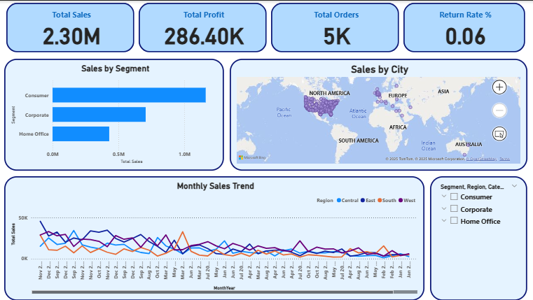
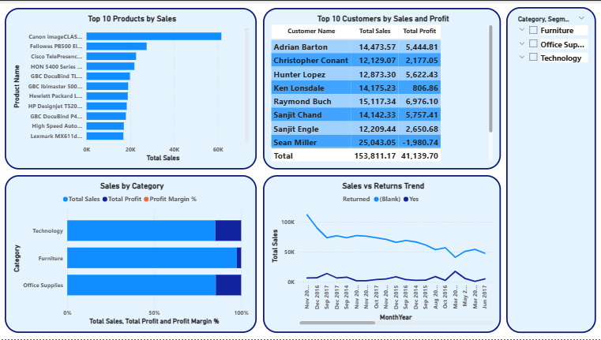
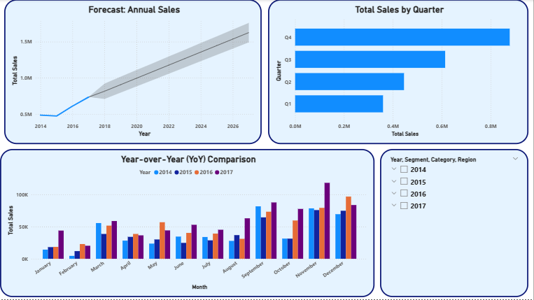

# 📊 Sales Performance Dashboard (Power BI)

This Power BI project analyzes a fictional sales dataset to provide key insights into business performance.

It includes KPIs such as Total Sales, Profit, Orders, and Return Rate, as well as regional and category-based performance breakdowns. The dashboard is designed to help managers and stakeholders make informed decisions quickly and effectively.

## 📁 Dashboard Pages

### 1. Executive Summary
- Total Sales, Profit, Orders, Return Rate
- Monthly Sales Trend (Line Chart)
- Sales by segment (Bar Chart)
- U.S. Sales Map by City

### 2. Category Analysis
- Top 10 Product by Sales
- Top 10 Customers by sales 
- Sales by Category
- Sales and Return Trend

### 3. Forecasting
- Annual Sales Forecast (Time Series)
- Trend Line & Seasonality Detection
- Year Over Year Comparition

## 🛠 Tools Used

- Power BI
- DAX (Data Analysis Expressions)
- Excel (Sample Dataset)
- Data Modeling & Relationships

## ▶️ How to Use

1. Clone this repository or download the `.pbix` file.
2. Open the file in Power BI Desktop.
3. Explore the three report pages using the tabs or navigation buttons.

## 🖼 Screenshots

### Executive Summary

### Category Analysis

### Forecasting

## 📦 Dataset

Sample dataset from [Microsoft Power BI Sample Data](https://learn.microsoft.com/en-us/power-bi/create-reports/sample-datasets).

## 📝 License

This project is licensed under the MIT License.

## 🙋‍♂️ Author

**MRTZ90**  
Data Analyst | Power BI Enthusiast  
